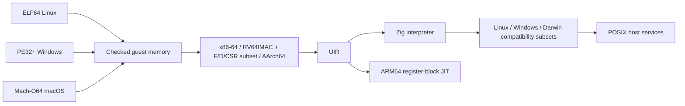

<p align="center">
  
</p>

<p align="center">
  <a href="https://github.com/OthmaneBlial/universe/releases/tag/v0.1.0"></a>
  
  <a href="LICENSE"></a>
  
</p>

<p align="center">
  
</p>

<h1 align="center">🛂 Guest passport control: cleared for launch.</h1>

<p align="center">
  <strong>🧳 Foreign binaries. Real execution. One shared runtime.</strong><br>
  Linux, Windows and library-free macOS guests visit an ARM64 Mac.
</p>

<p align="center">
  <a href="https://othmaneblial.github.io/universe/">🌐 Explore the universe</a> ·
  <a href="https://github.com/OthmaneBlial/universe/releases/tag/v0.1.0">📦 Download v0.1.0</a> ·
  <a href="#-launch-your-first-guest">🚀 Quick start</a> ·
  <a href="docs/compatibility.md">🧭 Compatibility</a> ·
  <a href="docs/architecture.md">🧬 Inside the runtime</a>
</p>

---

🧳 A Linux binary walks into a Mac. UNIVERSE handles passport control.

UNIVERSE is an experimental universal binary runtime written in Zig. Its own
loaders, CPU decoders, universal IR, interpreter, ARM64 JIT and OS compatibility
layers execute real foreign machine code. No QEMU, Wine, Rosetta or emulator
library is involved.

Current `main` also verifies private file mappings and PIE across all three
Linux guest architectures, plus x86-64, AArch64 and soft-float RISC-V musl
dynamic executables and shared libraries with constructors and TLS. Windows
guests import, load and unload source-built DLLs with rebasing, exports and
guest attach/detach callbacks, plus named/ordinal OLEAUT32 BSTR and variant APIs
and USER32 Unicode-unit/string navigation utilities. ADVAPI32 adds host entropy,
checked process-token handles and an empty read-only registry; Windows ACLs
remain unsupported. Our legacy MSVCRT subset adds allocation/string operations,
original argv, unbuffered standard streams and guest initializer/exit callbacks.
Single-thread events/semaphores, recursive critical sections and timed waits
now run through our own Win32 layer.
Windows file operations add no-overwrite moves, hard links, pending deletion,
checked metadata and large-file seeking, with host files still opt-in.
Read-only directory/link handles and symbolic-link reparse queries use the same
checked handle layer; the PE entry stack now supplies the four Win64 home slots.
Calendar/FILETIME conversions, current local/UTC clocks, virtual process timing
and checked file timestamp updates also use our own Win32 implementation.
Terminal input modes and guest Ctrl+C/break callbacks now work with real host
terminals and signals; output screen buffers remain unsupported.
Windows file sections now share checked views, copy private guest pages on
write and flush changed pages to real files, including sparse offsets above 4 GiB.
Library-free x86-64/AArch64 Mach-O
guests execute through a small Darwin BSD syscall layer. Recent Linux file
creation, rename and timestamp operations stay behind `--allow-files`. These
additions are newer than v0.1.0.
Linux guest threads now have separate CPU/TLS contexts and real futex wait queues.
The musl pthread fixture checks mutexes, condition waits, joins, preemption and
timed waits on all three CPUs in both engines. Blocking guest pipes transfer
32,769 exact bytes with backpressure and EOF while other guest threads run.
[Thread profile and limits](docs/linux-threads.md).
Linux fork children now have private memory and descriptor tables. Fork/wait/exec
runs selected BusyBox subshells, command substitution and external pipelines;
all processes share the execution and mapped-memory budgets.
[Process profile and limits](docs/linux-processes.md).
The x86-64 guests now check `POPCNT`, `BSWAP`, SSE4.2 `CRC32C` and `PCMPGTQ`,
plus selected SSE2/SSE3, SSSE3 and SSE4.1 integer and floating-point operations against exact
expected results. This is a checked subset, not a complete CPU; [the compatibility map](docs/compatibility.md)
lists each supported instruction. `CPUID` now reports a conservative virtual
CPU, and `RDTSC`, legacy SSE half-register moves and short accumulator `XCHG`
forms are checked. Paired `CMPXCHG8B/16B`, original MMX operations and bounded
`FXSAVE/FXRSTOR` state images now have exact guest oracles. MMX/XMM bridge moves
and all six MMX floating conversions also have checked rounding, physical
register data and exception state. Fifteen SSE/SSE2 MMX integer forms also
cover qword arithmetic, unsigned products, averages, min/max, byte differences,
word shuffle/insert/extract and byte masks. Sixteen SSSE3 MMX forms add byte
shuffles, alignment, sign/absolute values, horizontal sums/differences and
rounded/saturating products. The unchanged [Debian glibc probe](docs/debian.md) reaches
TLS initialization and then rejects the missing CPU baseline; GNU Hello is
not advertised as running.

## 🚀 Launch your first guest

Requires **Zig 0.16.0**, Python 3 and macOS or Linux. Execution was verified on an
Apple M2 running macOS 26.6; Linux builds are cross-compiled, not device-tested.

```sh
git clone https://github.com/OthmaneBlial/universe.git
cd universe
zig build -Doptimize=ReleaseSafe
python3 scripts/fixtures.py
file artifacts/guests/x86_64/hello-asm
uname -m
./zig-out/bin/universe artifacts/guests/x86_64/hello-asm
# Hello from x86-64 Linux!
./zig-out/bin/universe artifacts/guests/riscv64/compute
# compute: ok
./zig-out/bin/universe artifacts/guests/riscv64/compressed/compute
# compute: ok (RV64IMC instruction stream)
./zig-out/bin/universe artifacts/guests/riscv64/floating
# riscv F/D CSR: ok
./zig-out/bin/universe artifacts/guests/aarch64/system
# system: ok
./zig-out/bin/universe artifacts/guests/aarch64/pthread
# pthread: TLS, mutex, condition wait, joins and shared total=12000 ok
# pthread: CPU preemption, reused slots, TLS and timed condition wait ok
# pthread: scheduler sleeps and timed wakeups ok
# pthread: pipe blocking, backpressure, exact 32769 bytes and EOF ok
./zig-out/bin/universe artifacts/musl-hello
# Hello from static musl!
./zig-out/bin/universe artifacts/hello.exe
# Hello from Windows x86-64!
```

## 🌍 Real apps, fresh from the internet

Download the official **jq 1.8.2**, **ripgrep 15.2.0**, **7-Zip 26.03**, **fd 10.5.0** and **BusyBox 1.35.0** Linux x86-64
executables, verify their checksums and run them on your Mac:

```sh
zig build -Doptimize=ReleaseSafe
python3 scripts/public-apps.py
python3 tests/public-apps.py
printf '{"answer":42}\n' | ./zig-out/bin/universe artifacts/public-apps/jq '.answer'
# 42
printf 'alpha\nbeta\ngamma\n' | ./zig-out/bin/universe --allow-files artifacts/public-apps/rg --threads 1 -n '^(alpha|gamma)'
# 1:alpha
# 3:gamma
./zig-out/bin/universe --allow-files artifacts/public-apps/7zzs \
  a -tzip -mmt=off -mx=1 artifacts/universe-docs.zip README.md
# Everything is Ok — a real ZIP archive of this README
./zig-out/bin/universe --allow-files --max-instructions 30000000 --timeout-ms 30000 \
  artifacts/public-apps/fd --threads 2 --color never --type f --extension c . examples
# Find the real C examples with the unchanged Linux fd binary
./zig-out/bin/universe artifacts/public-apps/busybox printf '%s:%04d\n' hello 42
# hello:0042
```

Build current `main` with ReleaseSafe first. These are unchanged upstream
binaries; the checks cover JSON processing, text searches, archive creation and
extraction, file bytes, timestamps and error exits in interpreter/JIT modes.
ripgrep needs file access for its working-directory query. Stdin examples use
one thread; directory searches and file listings also pass with `--threads 2`.
7-Zip's checks cover `-mmt=off` and threaded `-mmt=2` 7z round trips, with file
access enabled. fd adds file/directory/symlink searches, Unicode and NUL output,
ignore/hidden rules, extension/glob/depth/exclusion filters, absolute paths,
two-thread traversal and error exits. The Linux suite passes **322 workflows**
across both engines, including 19 fd and 107 BusyBox checks per engine. BusyBox
adds formatting, hashes, Base64, text filters, exact file copies/renames, virtual
identity and selected noninteractive shell scripts, including external commands.
Its older official binary is downloaded unchanged.

```sh
./zig-out/bin/universe artifacts/public-apps/busybox sh -c \
  'n=0; for x in 2 3 5; do n=$((n+x)); done; printf "%d\n" "$n"'
# 10
```

Shell functions, conditions, arithmetic, arguments, stdin and permitted file
redirection are checked too. Isolated fork/wait now runs command substitution,
subshells and pipelines, including 4,620 exact bytes through the bounded pipe.
Checked Linux exec now runs external BusyBox, jq and ripgrep commands. Selected
background jobs and signal traps now pass too, including background jq output,
child exit codes, SIGKILL status and repeated wait/reaping. Internal `/dev/null`
and `/dev/zero` now work inside an empty sysroot without file grants. BusyBox
background stdin, discarded output, zero-byte reads and character-device stat
records pass without native device files. Ordinary files and external exec still
require `--allow-files`. [Guest device profile](docs/linux-devices.md) ·
[Process profile and limits](docs/linux-processes.md).

The official Windows x64 **7-Zip 26.03** runs on the same Mac too:

```sh
python3 scripts/public-apps.py --windows
./zig-out/bin/universe --allow-files artifacts/public-apps/7za.exe \
  a -tzip -mmt=off -mx=1 artifacts/windows-docs.zip README.md
./zig-out/bin/universe --allow-files artifacts/public-apps/7za.exe \
  t -mmt=off artifacts/windows-docs.zip
# Everything is Ok
python3 tests/public-apps.py --windows
```

**34 Windows workflows pass**, including ZIP/7z round trips, Unicode filenames,
hashing, recursive folders and corrupt/missing input. Denied reads and writes
now execute the app's own C++ cleanup/catch code and return application exit 2.
The download script now extracts the pinned Windows release using Linux 7-Zip
running inside UNIVERSE. Fresh extraction preserves all 1,335,296 executable
bytes; no system 7z extractor is needed. The first extraction can take several
minutes. The Windows executable then uses UNIVERSE's own CPU, loader and APIs.
[Downloads, tested workflows and boundaries](docs/public-apps.md).

### 🧭 The current flight manifest

Core guests are rebuilt from checked-in C/assembly. Downloaded app releases
retain their upstream executable bytes. UNIVERSE implements their CPU execution
and ABI translation.

| Guest | Format | Status on macOS ARM64 |
|---|---|---|
| 🌍 jq 1.8.2 + ripgrep 15.2.0 + 7-Zip 26.03 + fd 10.5.0 + BusyBox 1.35.0 | Linux x86-64 ELF64 | Unchanged binaries: JSON/text, ZIP/7z archives, hashing, file searches and BusyBox utility/file/identity/built-in script workflows in both engines |
| 📦 7-Zip 26.03 | Windows x86-64 PE32+ | Unchanged release: 34 verified archive/hash and error workflows, including C++ cleanup/catch on denied access |
| 🐧 Linux x86-64 | ELF64 | Assembly, twelve core libc-free C fixtures, PIE and static musl; paired atomics, original MMX, bounded state images, four-mode SSE floating controls, `POPCNT`/`BSWAP`, SSE4.2 CRC32C/PCMPGTQ and selected SSE2–SSE4.1 suites |
| 🐧 Linux RISC-V64 | ELF64 | Ten RV64IM/IMC fixtures, word/doubleword atomics and a hard-float F/D transfer, arithmetic, conversion and CSR subset fixture |
| 🐧 Linux AArch64 | ELF64 | Ten integer C fixtures, NEON arithmetic/logic/compare checks and 8,448 TBL/TBX/MLA/MLS queries per engine matching scalar and native ARM64 bytes |
| 🧵 Linux pthreads / all three CPUs | ELF64 | Actual musl mutexes, condition waits, joins, TLS, preemption, timed waits and blocking pipe transfers in both engines |
| 🪟 Windows x86-64 | PE32+ | Terminal input/control callbacks, shared file views, directory/link reparse metadata, loaded module paths, UTF-8/UTF-16 conversion, virtual CPU/memory and disk-space queries, file mutations/metadata/times, guest DLLs/TLS, OLEAUT32/USER32/ADVAPI32 subsets, legacy CRT and single-thread events/semaphores/waits/locks |
| 🍎 macOS x86-64/ARM64 | Mach-O64 | Five library-free CLI fixtures: console, argv/env, memory and files |
| 📦 BusyBox 1.37.0 x86-64 | Static ELF64 | Optional selected coreutils and file applets |
| 🗃️ SQLite 3.53.4 x86-64 | Static ELF64 | Optional batch CLI: transactions, persisted databases, rollback, VACUUM and native reopen |
| 🔗 musl 1.2.5 x86-64 / AArch64 / RISC-V | Dynamic ELF64 / PIE | Optional shared-library, constructor and TLS fixture; RISC-V uses soft-float LP64 |

The RISC-V floating-point fixture verifies selected F/D transfers, conversions,
comparisons, all five standard rounding modes for arithmetic and accrued
exception flags. The implemented x86 SSE arithmetic and conversions use all four
MXCSR rounding modes, DAZ/FTZ and staged exception flags. Unmasked conditions
stop with a named engine fault; CPU fault-to-signal delivery remains unsupported.
RCP/RSQRT follow their separate exception-free approximation rules.
This is **partial compatibility**, not arbitrary
Linux/Windows/macOS applications, complete CPU instruction sets or full shell functionality. See [exact instruction,
syscall and application coverage](docs/compatibility.md).

## 🪐 BusyBox takes a trip to macOS

```sh
python3 scripts/busybox.py
python3 tests/busybox.py
./zig-out/bin/universe artifacts/busybox-1.37.0/busybox echo hello
./zig-out/bin/universe artifacts/busybox-1.37.0/busybox sort <<EOF
zebra
apple
EOF
./zig-out/bin/universe artifacts/busybox-1.37.0/busybox grep needle <<EOF
needle one
other
EOF
./zig-out/bin/universe --allow-files artifacts/busybox-1.37.0/busybox ls examples
```

The optional script downloads checksum-pinned official source and compiles a
minimal static guest with selected applets, including `echo`, `printf`, `grep`,
`sed`, `tr`, `uniq`, `sort`, `wc`, and file utilities such as `cp`, `mv` and
`touch`. Tests cover selected text and file operations; this is not a full
BusyBox build or shell. Requires Python 3.12+, make, native `cc` and network
access.
[Build details and GPL guest license](docs/busybox.md).

## 🗃️ Take your database into orbit

```sh
python3 scripts/sqlite.py
python3 tests/sqlite.py
./zig-out/bin/universe artifacts/sqlite-x86_64 -batch :memory: 'select 6 * 7;'
# 42
```

The upstream SQLite CLI now runs SQL queries and file-backed transactions.
Checks cover indexes, joins, Unicode/blobs, rollback, delete/truncate journals,
VACUUM, native database reopen and real lock contention in interpreter/JIT paths.
Database files require `--allow-files`. This optional static build disables
threads and extension loading. WAL and SQLite signal interruption remain unverified.
[Reproduce the build and see its limits](docs/sqlite.md).

## 🔗 Let a shared library join the mission

```sh
python3 scripts/musl.py --arch all
python3 tests/musl.py --arch all
./zig-out/bin/universe --allow-files --sysroot artifacts/musl-sysroot \
  --env UNIVERSE_TEST=dynamic artifacts/musl-dynamic-pie check
# dynamic musl: imports, constructors and TLS ok
```

The checksum-pinned upstream musl linker executes as guest machine code in
UNIVERSE, including symbol relocation and single-thread TLS initialization on
all three CPUs.
Requires Python 3.12+, make, awk and network access. `--sysroot` prefixes absolute
Linux file paths; it is not filesystem confinement.
[Build details and tested scope](docs/musl.md).

Windows libraries get a seat, too:

```sh
./zig-out/bin/universe --allow-files --sysroot artifacts/windows-sysroot \
  artifacts/windows-dll.exe
# windows DLL: imports, exports, relocations and initialization ok
./zig-out/bin/universe --allow-files --sysroot artifacts/windows-sysroot \
  artifacts/windows-dynamic.exe
# windows dynamic DLL: references, forwarders, detach and reload ok
./zig-out/bin/universe artifacts/windows-automation-ordinal.exe
# windows automation: named/ordinal imports, BSTR ownership and variants ok
./zig-out/bin/universe artifacts/windows-text.exe
# windows text: Unicode units, pointer/character forms and DBCS navigation ok
./zig-out/bin/universe artifacts/windows-security.exe
# windows security: entropy, token rights, empty registry and explicit ACL limits ok
./zig-out/bin/universe artifacts/windows-crt.exe core '' 'a b' 'a"b' 'tail\' 'é🚀'
# BCA windows CRT: memory, argv/data, streams and nested/LIFO callbacks ok
./zig-out/bin/universe artifacts/windows-sync.exe
# windows sync: shared events/semaphores, waits, recursive locks and virtual CPU clocks ok
./zig-out/bin/universe artifacts/windows-fileops.exe
# windows fileops: denied
./zig-out/bin/universe artifacts/windows-time.exe
# windows time: checked calendars, local/UTC conversion and process clocks ok
./zig-out/bin/universe artifacts/windows-console.exe
# windows console: stream types, UTF-8 policy and handler registration ok
./zig-out/bin/universe artifacts/windows-mapping.exe
# windows mapping: shared sections, guest-page COW, names and view lifetimes ok
python3 tests/windows-encoding.py
# checks UTF-8/UTF-16 conversion against independent Python codecs in both engines
python3 tests/windows-modules.py
# checks loaded module paths, filename buffers and DLL lifetimes in both engines
python3 tests/windows-local.py
# checks local allocations, resizing, locks, discard and exact bytes in both engines
python3 tests/windows-message.py
# checks diagnostics, typed message inserts and buffers against native/Python oracles
python3 tests/windows-directory.py
# checks current/temp paths, sysroot round trips and real file/DLL behavior in both engines
python3 tests/windows-find.py
# checks real file enumeration, DOS wildcard patterns, metadata and search lifetimes
python3 tests/windows-stream.py
# checks default stream sizes, A/W file access, sharing, mutations and typed search lifetimes
python3 tests/windows-metadata.py
# checks real directory/link identities, dangling links, sharing and handle lifetimes
python3 tests/windows-device.py
# checks native reparse records, Unicode targets, capacities and checked failures
python3 tests/windows-stack.py
# checks Win64 entry alignment and all four caller-provided home slots
./zig-out/bin/universe artifacts/windows-unwind.exe
# windows unwind: compiler function table lookup and checked module identity ok
./zig-out/bin/universe artifacts/windows-exception.exe
# result=42 cleanup=23154 (three guest destructors, typed catch and continuation)
# value/scalar/catch-all: 51 throws ok; nested cleanup=8796
python3 tests/windows-drives.py
# checks real C-drive round trips, A/W drive strings and native disk statistics
```

The core fixture builder supplies guest DLLs, including a cyclic import graph.
Their machine code, exports, relocations and `DllMain` run in UNIVERSE. Automation
fixtures use our own BSTR/variant APIs without external Windows DLLs. Windows
7-Zip now binds its OLEAUT32, USER32, ADVAPI32 and all 39 MSVCRT imports,
then binds synchronization, file/time, console, mapping, virtual CPU/memory,
disk-space, UTF-8/UTF-16 conversion, module filename, local-memory, message, directory, file/stream-enumeration, logical-drive and DeviceIoControl imports. All static imports bind. Both engines complete 17 unchanged Windows 7-Zip workflows each, including denied-access exits through our own C++ unwind/catch implementation.
The C++ profile supports bounded POD throws and real guest cleanup/catch funclets.
Nested/uncaught throws, rethrows, nontrivial exception-object copies/destructors and SEH/RTTI remain explicit faults; broad CRT support
and guest threads remain missing. USER32 uses bundled BMP simple-uppercase data and DBCS lead-byte
rules; native Windows NLS parity remains unverified.
The file-operation guest defaults to denied access. Local integration checks
grant files only in temporary directories and verify moves, deletion lifetimes,
hard links, sparse offsets and host metadata. Cross-volume moves, progress
callbacks and broad Windows attributes remain unsupported.
File enumeration checks 9,112 SDK replies per engine against recursive wildcard
and host metadata oracles. Search cursors survive cwd changes and directory renames;
checked write failures preserve buffers and cursors. [Enumeration scope](docs/windows.md#file-enumeration).
Default stream checks compare 2,145 exact SDK replies per engine, including real
Unicode A/W reads/writes through `::$DATA`, sharing, resizing and pending deletion.
File and stream searches share 1,024 owned slots. Named alternate streams remain
unsupported. [Stream scope](docs/windows.md#default-data-streams).
One virtual C drive maps to the sysroot, or host `/` without one. Current/temp
queries return reusable DOS paths; absolute and drive-relative C names work with
real file operations, including canonical absolute `\\?\C:\...` names. Drive enumeration passes 189 exact A/W SDK replies per
engine, including native disk statistics and file creation through the returned
root. Other drives and UNC/device namespaces remain unavailable.
[Drive and directory scope](docs/windows.md#current-directories-and-temporary-paths).
The time guest needs no file grant for calendars and clocks. Local checks also
verify actual host timestamps in temporary directories; native Windows time-zone
and filesystem parity remain unverified. [Time API scope](docs/windows.md#calendar-clocks-and-file-times).
The console guest checks UTF-8 policy and handler registration. Local tests use
real pipes, isolated terminals and native signals to verify raw/cooked input,
LIFO handlers, ignored Ctrl+C, interrupted reads and cleanup. Callbacks run
serially on the initial guest thread; output modes and screen buffers fail
explicitly. [Console scope](docs/windows.md#terminal-input-and-control-callbacks).
The mapping guest checks coherent aliases, private 4 KiB pages, named-section
lifetimes and executable guest views. Local file checks verify sparse offsets,
exact flushed bytes, close/unmap order and pending deletion. Views stay inside
checked memory and execute through our CPU engine. [Mapping scope](docs/windows.md#file-sections-and-mapped-views).
[Windows scope and limits](docs/windows.md).
Function-table lookup now reads real compiler-generated PE records through
`RtlLookupFunctionEntry`. Frame unwinding and C++ catch/cleanup execution remain
the next step. [Exact lookup scope](docs/windows.md#function-table-lookup).

## 🍎 Another world joins the orbit

```sh
# macOS + Apple's installed command-line tools
python3 scripts/macos.py
./zig-out/bin/universe artifacts/macos/x86_64/hello
# Hello from macOS guest machine code!
./zig-out/bin/universe --env KEY=value artifacts/macos/aarch64/arguments hello
```

Both Mach-O guests run through UNIVERSE's own CPU engine. They link no guest
libraries; dyld and LibSystem are unsupported. Matching-host native builds of
the same syscall test source provide additional comparisons.
[Mach-O loading, Darwin ABI and validation boundaries](docs/macos.md).

## 🎛️ Take the controls

```sh
./zig-out/bin/universe inspect artifacts/guests/x86_64/hello-asm
./zig-out/bin/universe inspect --ir --count 8 artifacts/guests/x86_64/hello-asm
./zig-out/bin/universe trace artifacts/hello.exe
./zig-out/bin/universe --stats --jit artifacts/guests/riscv64/benchmark
./zig-out/bin/universe --env KEY=value artifacts/guests/aarch64/arguments foo bar
./zig-out/bin/universe debug artifacts/guests/x86_64/hello-asm
```

Debugger: run, continue, step, break, registers, memory, stack, disasm, ir,
syscalls, quit. Unsupported behavior stops with the guest PC, bytes and a named
error. Guest exit codes pass through; runtime faults return 125.

## 🧬 Inside the engine



[Architecture](docs/architecture.md) · [UIR](docs/uir.md) ·
[Memory](docs/memory-model.md) · [ELF](docs/elf-loader.md) ·
[Windows](docs/windows.md) · [macOS](docs/macos.md) · [JIT](docs/jit.md) · [Debugger](docs/debugger.md) ·
[Roadmap](docs/roadmap.md) · [Primary specifications](docs/references.md)

## 🧪 Reproduce the proof

```sh
./scripts/check.sh
python3 scripts/benchmark.py
```

The local check verifies formatting, ReleaseSafe build, Zig unit/fuzz-seed tests,
all core guest fixtures, output/status/filesystem/syscall behavior, debugger,
JIT equivalence, malformed binaries and memory faults, then deterministic fuzz
mutations. x87 arithmetic, square roots, integral rounding, exponent/significand
extraction, remainders, scaling and comparisons also run through an exact rational/bit
oracle in both engines. F2XM1, FYL2X, FYL2XP1, FPATAN, FSIN/FCOS, FPTAN
and FSINCOS add high-precision decimal checks for their specified input ranges,
tiny products/angles, quadrants, large-angle reduction, paired stack results,
neighbors of one and rounding modes. Universal correct rounding and native
x87 parity remain unverified.
Mach-O fixtures and matching-host native syscall source comparisons
run on macOS with Apple command-line tools. Native ELF differential checks run
on a matching Linux host. Optional
BusyBox, SQLite and dynamic musl checks are separate. The transfer oracle also
checks packed BCD loads/stores, signed zero and decimal rounding boundaries.
Legacy x87 environment and
full-state images have their own byte oracle for both operand layouts, restored
tags and deferred faults. SSE/MMX streaming stores and ANDNPS/ANDNPD add
91,072 exact byte/state queries per engine, including every XMM/MMX byte mask,
register aliases, guard bytes and unchanged flags/MXCSR. PUSHFW/PUSHFQ and
auxiliary carry now use the modeled flag image with checked stack writes.
RCPPS/RCPSS and RSQRTPS/RSQRTSS add 85,996 independent rational/integer-root
byte/state checks per engine, including all normal exponents, special classes,
underflow boundaries, scalar lanes and unchanged flags/MXCSR. Their bounded
approximation profile does not claim native x86 lookup-table bit parity.
MMX/XMM bridge moves and MMX floating conversions add 24,653 exact rational/
byte/state queries and 33 fault exits per engine, including raw x87 data,
tags/TOP, four rounding modes, upper lanes and pending/unmasked exceptions.
The expanded mixed MMX oracle adds 49,303 integer/state queries and checks
all 256 immediate values, shuffle control bytes and zero/selection masks:
73,956 queries and 121 fault exits per engine across 102 real encoding views.
**GitHub Actions is disabled** at
the owner's request. Run the full check locally with `./scripts/check.sh`.

[Local validation evidence](docs/validation.md) and
[reproducible benchmark results](benchmarks/results.md) compare interpreter,
partial JIT and native host C on the same integer workload. The JIT speeds up
this RISC-V case and slows down the measured x86/AArch64 cases. It remains opt-in;
no general application speed claim is made.

## 🌌 The next expedition

The core idea works. Broader application compatibility is where the next big
steps happen: richer CPU/SIMD coverage, broader dynamic Linux guests and processes,
remaining Windows APIs and exception handling, and macOS dyld/shared-library support.

Follow the [roadmap](docs/roadmap.md), bring a source-built failing guest, or
[open an issue](https://github.com/OthmaneBlial/universe/issues). Each new
working program should leave a reproducible regression behind.

## 🛡️ Know the flight rules

**Not a security sandbox.** Guest memory, resource limits, validated syscall
buffers and W^X JIT pages are implemented, but there has been no independent
security review. Environment is empty unless `--env` is supplied. Files are
denied by default. `--allow-files` grants host-user file privileges, including
creation and truncation. [Security status and limits](docs/security.md).

Apache-2.0. [Third-party notices](THIRD_PARTY_NOTICES.md). Contributions should include a small instruction regression or
source-built failing guest fixture and a reproducible local check.
