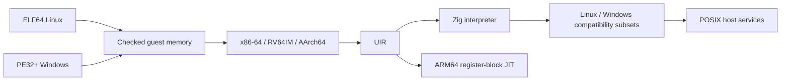

<p align="center">
  
</p>

<p align="center">
  <a href="https://github.com/OthmaneBlial/universe/releases/tag/v0.1.0"></a>
  
  <a href="LICENSE"></a>
  
</p>

<h3 align="center">🪐 Different binaries. One shared runtime.</h3>

<p align="center">
  <strong>Run software that was never built for your computer.</strong><br>
  Linux machine code on an ARM64 Mac. Windows console fixtures, too.
</p>

<p align="center">
  <a href="https://othmaneblial.github.io/universe/">🌐 Explore the universe</a> ·
  <a href="https://github.com/OthmaneBlial/universe/releases/tag/v0.1.0">📦 Download v0.1.0</a> ·
  <a href="#-launch-your-first-guest">🚀 Quick start</a> ·
  <a href="docs/compatibility.md">🧭 Compatibility</a> ·
  <a href="docs/architecture.md">🧬 Inside the runtime</a>
</p>

---

A Linux binary walks into a Mac. UNIVERSE does the translating.

UNIVERSE is an experimental universal binary runtime written in Zig. Its own
loaders, CPU decoders, universal IR, interpreter, ARM64 JIT and OS compatibility
layers execute real foreign machine code. No QEMU, Wine, Rosetta or emulator
library is involved.

## 🚀 Launch your first guest

Requires **Zig 0.16.0**, Python 3 and macOS or Linux. Execution was verified on an
Apple M2 running macOS 26.6; Linux builds are cross-compiled, not device-tested.

```sh
git clone https://github.com/OthmaneBlial/universe.git
cd universe
zig build -Doptimize=ReleaseSafe
python3 scripts/fixtures.py
file artifacts/guests/x86_64/hello-asm
uname -m
./zig-out/bin/universe artifacts/guests/x86_64/hello-asm
# Hello from x86-64 Linux!
./zig-out/bin/universe artifacts/guests/riscv64/compute
# compute: ok
./zig-out/bin/universe artifacts/guests/aarch64/system
# system: ok
./zig-out/bin/universe artifacts/musl-hello
# Hello from static musl!
./zig-out/bin/universe artifacts/hello.exe
# Hello from Windows x86-64!
```

### 🧭 The current flight manifest

Guests are rebuilt from checked-in C/assembly. Zig/Clang builds them; UNIVERSE
implements their CPU execution and ABI translation.

| Guest | Format | Status on macOS ARM64 |
|---|---|---|
| 🐧 Linux x86-64 | ELF64 | Assembly, eight libc-free C fixtures, static musl Hello World |
| 🐧 Linux RISC-V64 | ELF64 | Eight RV64IM C fixtures |
| 🐧 Linux AArch64 | ELF64 | Eight integer C fixtures |
| 🪟 Windows x86-64 | PE32+ | Console I/O and VirtualAlloc/free fixtures |
| 🍎 macOS x86-64/ARM64 | Mach-O64 | Inspection only; execution rejected |
| 📦 BusyBox 1.37.0 x86-64 | Static ELF64 | Optional minimal echo/cat/ls build |

This is **partial compatibility**, not arbitrary Linux/Windows applications,
complete CPU instruction sets or a working BusyBox shell. See [exact instruction,
syscall and application coverage](docs/compatibility.md).

## 🪐 BusyBox takes a trip to macOS

```sh
python3 scripts/busybox.py
python3 tests/busybox.py
./zig-out/bin/universe artifacts/busybox-1.37.0/busybox echo hello
./zig-out/bin/universe --allow-files artifacts/busybox-1.37.0/busybox ls examples
```

The optional script downloads checksum-pinned official source and compiles a
minimal static guest. Requires Python 3.12+, make, native `cc` and network access.
[Build details and GPL guest license](docs/busybox.md).

## 🎛️ Take the controls

```sh
./zig-out/bin/universe inspect artifacts/guests/x86_64/hello-asm
./zig-out/bin/universe inspect --ir --count 8 artifacts/guests/x86_64/hello-asm
./zig-out/bin/universe trace artifacts/hello.exe
./zig-out/bin/universe --stats --jit artifacts/guests/riscv64/benchmark
./zig-out/bin/universe --env KEY=value artifacts/guests/aarch64/arguments foo bar
./zig-out/bin/universe debug artifacts/guests/x86_64/hello-asm
```

Debugger: run, continue, step, break, registers, memory, stack, disasm, ir,
syscalls, quit. Unsupported behavior stops with the guest PC, bytes and a named
error. Guest exit codes pass through; runtime faults return 125.

## 🧬 Inside the engine



[Architecture](docs/architecture.md) · [UIR](docs/uir.md) ·
[Memory](docs/memory-model.md) · [ELF](docs/elf-loader.md) ·
[Windows](docs/windows.md) · [JIT](docs/jit.md) · [Debugger](docs/debugger.md) ·
[Roadmap](docs/roadmap.md) · [Primary specifications](docs/references.md)

## 🧪 Reproduce the proof

```sh
./scripts/check.sh
python3 scripts/benchmark.py
```

The local check verifies formatting, ReleaseSafe build, Zig unit/fuzz-seed tests,
all core guest fixtures, output/status/filesystem/syscall behavior, debugger,
JIT equivalence, malformed binaries and memory faults, then deterministic fuzz
mutations. Native differential checks run on a matching Linux host. Optional
BusyBox checks are separate. **GitHub Actions is disabled** at the owner's request;
no workflow is installed.

[Local validation evidence](docs/validation.md) and
[reproducible benchmark results](benchmarks/results.md) compare interpreter,
partial JIT and native host C on the same integer workload. The JIT speeds up
this RISC-V case and slows down the measured x86/AArch64 cases. It remains opt-in;
no general application speed claim is made.

## 🌌 The next expedition

The core idea works. Broader application compatibility is where the next big
steps happen: richer CPU/SIMD coverage, Linux dynamic linking and processes,
Windows DLL/APIs, and actual Mach-O execution.

Follow the [roadmap](docs/roadmap.md), bring a source-built failing guest, or
[open an issue](https://github.com/OthmaneBlial/universe/issues). Each new
working program should leave a reproducible regression behind.

## 🛡️ Know the flight rules

**Not a security sandbox.** Guest memory, resource limits, validated syscall
buffers and W^X JIT pages are implemented, but there has been no independent
security review. Environment is empty unless `--env` is supplied. Files are
denied by default. `--allow-files` grants host-user file privileges, including
creation and truncation. [Security status and limits](docs/security.md).

Apache-2.0. [Third-party notices](THIRD_PARTY_NOTICES.md). Contributions should include a small instruction regression or
source-built failing guest fixture and a reproducible local check.
