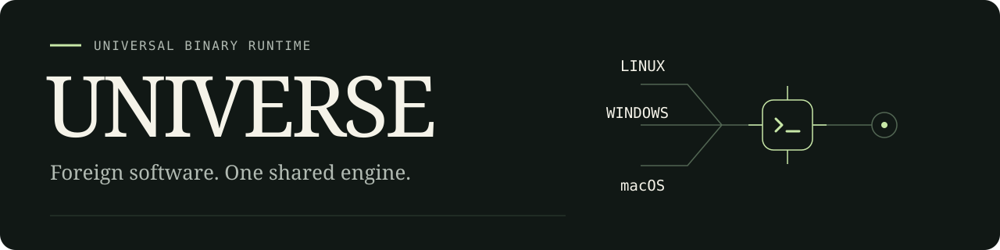
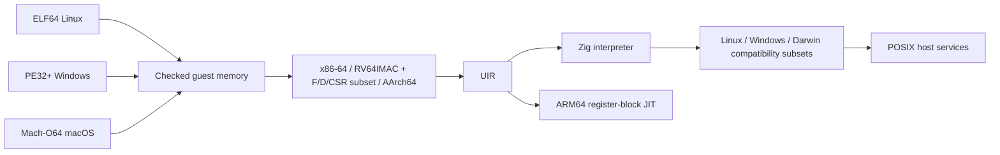

<p align="center">
  
</p>

<p align="center">
  <a href="https://github.com/OthmaneBlial/universe/releases/tag/v0.1.0"></a>
  
  <a href="LICENSE"></a>
  
</p>

<p align="center">
  
</p>

<h1 align="center">🛂 Guest passport control: cleared for launch.</h1>

<p align="center">
  <strong>🧳 Foreign binaries. Real execution. One shared runtime.</strong><br>
  Linux, Windows and library-free macOS guests visit an ARM64 Mac.
</p>

<p align="center">
  <a href="https://othmaneblial.github.io/universe/">🌐 Explore the universe</a> ·
  <a href="https://github.com/OthmaneBlial/universe/releases/tag/v0.1.0">📦 Download v0.1.0</a> ·
  <a href="#-launch-your-first-guest">🚀 Quick start</a> ·
  <a href="docs/compatibility.md">🧭 Compatibility</a> ·
  <a href="docs/architecture.md">🧬 Inside the runtime</a>
</p>

---

🧳 A Linux binary walks into a Mac. UNIVERSE handles passport control.

UNIVERSE is an experimental universal binary runtime written in Zig. Its own
loaders, CPU decoders, universal IR, interpreter, ARM64 JIT and OS compatibility
layers execute real foreign machine code. No QEMU, Wine, Rosetta or emulator
library is involved.

Current `main` also verifies private file mappings and PIE across all three
Linux guest architectures, plus x86-64, AArch64 and soft-float RISC-V musl
dynamic executables and shared libraries with constructors and TLS. Windows
guests import, load and unload source-built DLLs with rebasing, exports and
guest attach/detach callbacks. Library-free x86-64/AArch64 Mach-O
guests execute through a small Darwin BSD syscall layer. Recent Linux file
creation, rename and timestamp operations stay behind `--allow-files`. These
additions are newer than v0.1.0.
The x86-64 guests now check `POPCNT`, `BSWAP`, SSE4.2 `CRC32C` and `PCMPGTQ`,
plus selected SSE2/SSE3, SSSE3 and SSE4.1 integer and floating-point operations against exact
expected results. This is a checked subset, not a complete CPU; [the compatibility map](docs/compatibility.md)
lists each supported instruction. `CPUID` now reports a conservative virtual
CPU, and `RDTSC`, legacy SSE half-register moves and short accumulator `XCHG`
forms are checked. Paired `CMPXCHG8B/16B`, original MMX operations and bounded
`FXSAVE/FXRSTOR` state images now have exact guest oracles. The unchanged [Debian glibc probe](docs/debian.md) reaches
TLS initialization and then rejects the missing CPU baseline; GNU Hello is
not advertised as running.

## 🚀 Launch your first guest

Requires **Zig 0.16.0**, Python 3 and macOS or Linux. Execution was verified on an
Apple M2 running macOS 26.6; Linux builds are cross-compiled, not device-tested.

```sh
git clone https://github.com/OthmaneBlial/universe.git
cd universe
zig build -Doptimize=ReleaseSafe
python3 scripts/fixtures.py
file artifacts/guests/x86_64/hello-asm
uname -m
./zig-out/bin/universe artifacts/guests/x86_64/hello-asm
# Hello from x86-64 Linux!
./zig-out/bin/universe artifacts/guests/riscv64/compute
# compute: ok
./zig-out/bin/universe artifacts/guests/riscv64/compressed/compute
# compute: ok (RV64IMC instruction stream)
./zig-out/bin/universe artifacts/guests/riscv64/floating
# riscv F/D CSR: ok
./zig-out/bin/universe artifacts/guests/aarch64/system
# system: ok
./zig-out/bin/universe artifacts/musl-hello
# Hello from static musl!
./zig-out/bin/universe artifacts/hello.exe
# Hello from Windows x86-64!
```

### 🧭 The current flight manifest

Guests are rebuilt from checked-in C/assembly. Zig/Clang builds them; UNIVERSE
implements their CPU execution and ABI translation.

| Guest | Format | Status on macOS ARM64 |
|---|---|---|
| 🐧 Linux x86-64 | ELF64 | Assembly, ten core libc-free C fixtures, PIE and static musl; paired atomics, original MMX, bounded state images, four-mode SSE floating controls, `POPCNT`/`BSWAP`, SSE4.2 CRC32C/PCMPGTQ and selected SSE2–SSE4.1 suites |
| 🐧 Linux RISC-V64 | ELF64 | Ten RV64IM/IMC fixtures, word/doubleword atomics and a hard-float F/D transfer, arithmetic, conversion and CSR subset fixture |
| 🐧 Linux AArch64 | ELF64 | Ten integer C fixtures plus a NEON arithmetic/logic/compare oracle |
| 🪟 Windows x86-64 | PE32+ | Console/files, guest DLL loading, static TLS and 64-slot dynamic TLS APIs for one thread |
| 🍎 macOS x86-64/ARM64 | Mach-O64 | Five library-free CLI fixtures: console, argv/env, memory and files |
| 📦 BusyBox 1.37.0 x86-64 | Static ELF64 | Optional selected coreutils and file applets |
| 🗃️ SQLite 3.53.4 x86-64 | Static ELF64 | Optional batch CLI: transactions, persisted databases, rollback, VACUUM and native reopen |
| 🔗 musl 1.2.5 x86-64 / AArch64 / RISC-V | Dynamic ELF64 / PIE | Optional shared-library, constructor and TLS fixture; RISC-V uses soft-float LP64 |

The RISC-V floating-point fixture verifies selected F/D transfers, conversions,
comparisons, all five standard rounding modes for arithmetic and accrued
exception flags. The implemented x86 SSE floating operations now use all four
MXCSR rounding modes, DAZ/FTZ and staged exception flags. Unmasked conditions
stop with a named engine fault; guest signal handlers remain unsupported.
This is **partial compatibility**, not arbitrary
Linux/Windows/macOS applications, complete CPU instruction sets or a working BusyBox shell. See [exact instruction,
syscall and application coverage](docs/compatibility.md).

## 🪐 BusyBox takes a trip to macOS

```sh
python3 scripts/busybox.py
python3 tests/busybox.py
./zig-out/bin/universe artifacts/busybox-1.37.0/busybox echo hello
./zig-out/bin/universe artifacts/busybox-1.37.0/busybox sort <<EOF
zebra
apple
EOF
./zig-out/bin/universe artifacts/busybox-1.37.0/busybox grep needle <<EOF
needle one
other
EOF
./zig-out/bin/universe --allow-files artifacts/busybox-1.37.0/busybox ls examples
```

The optional script downloads checksum-pinned official source and compiles a
minimal static guest with selected applets, including `echo`, `printf`, `grep`,
`sed`, `tr`, `uniq`, `sort`, `wc`, and file utilities such as `cp`, `mv` and
`touch`. Tests cover selected text and file operations; this is not a full
BusyBox build or shell. Requires Python 3.12+, make, native `cc` and network
access.
[Build details and GPL guest license](docs/busybox.md).

## 🗃️ Take your database into orbit

```sh
python3 scripts/sqlite.py
python3 tests/sqlite.py
./zig-out/bin/universe artifacts/sqlite-x86_64 -batch :memory: 'select 6 * 7;'
# 42
```

The upstream SQLite CLI now runs SQL queries and file-backed transactions.
Checks cover indexes, joins, Unicode/blobs, rollback, delete/truncate journals,
VACUUM, native database reopen and real lock contention in interpreter/JIT paths.
Database files require `--allow-files`. This optional static build disables
threads and extension loading. WAL remains unverified; guest signal delivery is unsupported.
[Reproduce the build and see its limits](docs/sqlite.md).

## 🔗 Let a shared library join the mission

```sh
python3 scripts/musl.py --arch all
python3 tests/musl.py --arch all
./zig-out/bin/universe --allow-files --sysroot artifacts/musl-sysroot \
  --env UNIVERSE_TEST=dynamic artifacts/musl-dynamic-pie check
# dynamic musl: imports, constructors and TLS ok
```

The checksum-pinned upstream musl linker executes as guest machine code in
UNIVERSE, including symbol relocation and single-thread TLS initialization on
all three CPUs.
Requires Python 3.12+, make, awk and network access. `--sysroot` prefixes absolute
Linux file paths; it is not filesystem confinement.
[Build details and tested scope](docs/musl.md).

Windows libraries get a seat, too:

```sh
./zig-out/bin/universe --allow-files --sysroot artifacts/windows-sysroot \
  artifacts/windows-dll.exe
# windows DLL: imports, exports, relocations and initialization ok
./zig-out/bin/universe --allow-files --sysroot artifacts/windows-sysroot \
  artifacts/windows-dynamic.exe
# windows dynamic DLL: references, forwarders, detach and reload ok
```

The core fixture builder supplies guest DLLs, including a cyclic import graph.
Their machine code, exports, relocations and `DllMain` run in UNIVERSE. [Windows scope and limits](docs/windows.md).

## 🍎 Another world joins the orbit

```sh
# macOS + Apple's installed command-line tools
python3 scripts/macos.py
./zig-out/bin/universe artifacts/macos/x86_64/hello
# Hello from macOS guest machine code!
./zig-out/bin/universe --env KEY=value artifacts/macos/aarch64/arguments hello
```

Both Mach-O guests run through UNIVERSE's own CPU engine. They link no guest
libraries; dyld and LibSystem are unsupported. Matching-host native builds of
the same syscall test source provide additional comparisons.
[Mach-O loading, Darwin ABI and validation boundaries](docs/macos.md).

## 🎛️ Take the controls

```sh
./zig-out/bin/universe inspect artifacts/guests/x86_64/hello-asm
./zig-out/bin/universe inspect --ir --count 8 artifacts/guests/x86_64/hello-asm
./zig-out/bin/universe trace artifacts/hello.exe
./zig-out/bin/universe --stats --jit artifacts/guests/riscv64/benchmark
./zig-out/bin/universe --env KEY=value artifacts/guests/aarch64/arguments foo bar
./zig-out/bin/universe debug artifacts/guests/x86_64/hello-asm
```

Debugger: run, continue, step, break, registers, memory, stack, disasm, ir,
syscalls, quit. Unsupported behavior stops with the guest PC, bytes and a named
error. Guest exit codes pass through; runtime faults return 125.

## 🧬 Inside the engine



[Architecture](docs/architecture.md) · [UIR](docs/uir.md) ·
[Memory](docs/memory-model.md) · [ELF](docs/elf-loader.md) ·
[Windows](docs/windows.md) · [macOS](docs/macos.md) · [JIT](docs/jit.md) · [Debugger](docs/debugger.md) ·
[Roadmap](docs/roadmap.md) · [Primary specifications](docs/references.md)

## 🧪 Reproduce the proof

```sh
./scripts/check.sh
python3 scripts/benchmark.py
```

The local check verifies formatting, ReleaseSafe build, Zig unit/fuzz-seed tests,
all core guest fixtures, output/status/filesystem/syscall behavior, debugger,
JIT equivalence, malformed binaries and memory faults, then deterministic fuzz
mutations. Mach-O fixtures and matching-host native syscall source comparisons
run on macOS with Apple command-line tools. Native ELF differential checks run
on a matching Linux host. Optional
BusyBox, SQLite and dynamic musl checks are separate. **GitHub Actions is disabled** at
the owner's request. Run the full check locally with `./scripts/check.sh`.

[Local validation evidence](docs/validation.md) and
[reproducible benchmark results](benchmarks/results.md) compare interpreter,
partial JIT and native host C on the same integer workload. The JIT speeds up
this RISC-V case and slows down the measured x86/AArch64 cases. It remains opt-in;
no general application speed claim is made.

## 🌌 The next expedition

The core idea works. Broader application compatibility is where the next big
steps happen: richer CPU/SIMD coverage, broader dynamic Linux guests and processes,
remaining Windows APIs and exception handling, and macOS dyld/shared-library support.

Follow the [roadmap](docs/roadmap.md), bring a source-built failing guest, or
[open an issue](https://github.com/OthmaneBlial/universe/issues). Each new
working program should leave a reproducible regression behind.

## 🛡️ Know the flight rules

**Not a security sandbox.** Guest memory, resource limits, validated syscall
buffers and W^X JIT pages are implemented, but there has been no independent
security review. Environment is empty unless `--env` is supplied. Files are
denied by default. `--allow-files` grants host-user file privileges, including
creation and truncation. [Security status and limits](docs/security.md).

Apache-2.0. [Third-party notices](THIRD_PARTY_NOTICES.md). Contributions should include a small instruction regression or
source-built failing guest fixture and a reproducible local check.
