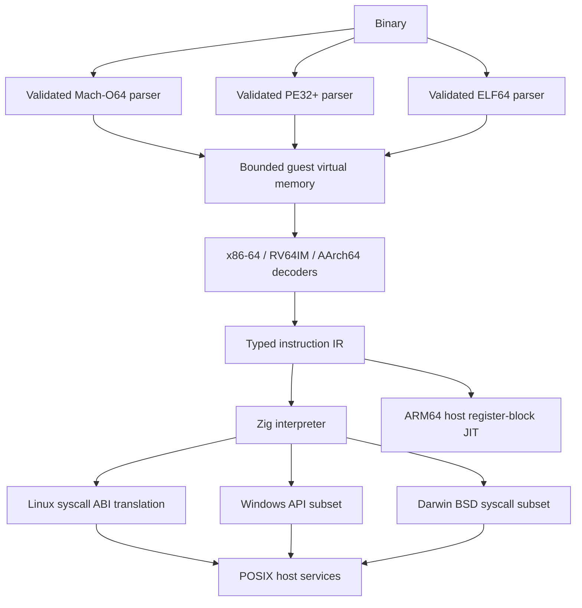

# Architecture

UNIVERSE owns the execution path. It never launches a guest with an emulator,
virtual machine, container or host executable loader.

The file bytes remain owned by the CLI until the runtime is destroyed. Loaders
copy loadable segment/section data into separately allocated guest regions. BSS starts at zero.
No guest address is cast to a host pointer. Decoders fetch from executable
regions; interpreted loads and stores enforce read/write permissions.

Registers, operand addressing, integer widths and control transfers are explicit
in UIR. Architecture decoders supply the guest instruction boundaries and CPU
specific operand semantics. The interpreter applies the register model (x86
partial writes, RISC-V x0, AArch64 SP/ZR), and executes the resulting operations.
The syscall translator reads the architecture's syscall argument registers and
serializes Linux structures instead of exposing host structs.

The Darwin layer translates its register, flag, errno and mapping conventions
to the existing checked POSIX services in `src/syscall/linux.zig`. Those services
receive canonical Linux encodings and a guest page size; they never invoke guest
code through the host Mach-O loader. Mach-O mappings retain segment maximum
protections, and the guest stack has argv, explicit environment and Apple path
entries. See [macos.md](macos.md).

The local validation command is `./scripts/check.sh`. GitHub Actions is disabled
at repository level and no workflow is installed, at the owner's request.
